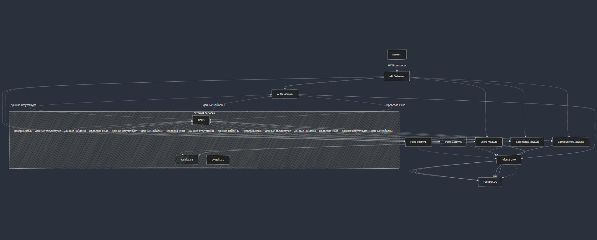

## Описание проекта "Forest Talk API"

Проект **Forest Talk API** — это серверное приложение, разработанное с использованием фреймворка **NestJS** для создания и поддержки API на основе REST, Websocket и GraphQL. Проект ориентирован на высокую производительность, расширяемость и безопасность.

---

### Стек технологий


1. **Фреймворк NestJS**:  
   Основной каркас приложения, построенный на базе Node.js и TypeScript, который упрощает создание модульного, хорошо структурированного и масштабируемого кода.

2. **TypeScript**:  
   Обеспечивает строгую типизацию, что помогает снизить вероятность ошибок и улучшает читаемость кода.

3. **Prisma ORM**:  
   Используется для работы с базой данных, предоставляя простой и мощный способ управлять миграциями, моделями и запросами к базе данных.

4. **JWT (JSON Web Token) и OAuth 2.0**:  
   механизмы для аутентификации и авторизации. JWT отвечает за авторизацию пользователей, а OAuth 2.0 обеспечивает возможность аутентификации через сторонние сервисы (например, Yandex или VK), повышая безопасность и удобство для пользователей.

5. **Swagger**:  
   Для документирования API и тестирования эндпоинтов, что упрощает взаимодействие с разработчиками и пользователями API.

6. **Redis**:  
   Используется для кэширования данных, что ускоряет доступ к часто запрашиваемым данным.

7. **AWS SDK**:  
   Для работы с Yandex S3, обеспечивающий удобное хранение и управление файлами в облаке.


### Альтернативы и обоснование выбора:

1. **Express.js** с использованием Sequelize ORM:

    - **Преимущества:** Express — более легковесный и быстрый фреймворк для   создания API, что могло бы ускорить разработку и повысить производительность.
    - **Недостатки:** отсутствует встроенная поддержка модульной архитектуры, что усложняет структуру проекта. Sequelize менее мощный и ограничен по сравнению с Prisma в контексте типов и миграций.

    **Почему не выбран:** NestJS предлагает более продвинутую модульную архитектуру и интеграцию с TypeScript, что делает его более подходящим для крупных проектов с требованиями к поддержке кода.

1. **Koa.js** с использованием TypeORM:

    - **Преимущества:** Koa — легковесный и гибкий фреймворк, который даёт разработчикам больше контроля над middleware и архитектурой.
    - **Недостатки:** требует написания большей части инфраструктуры с нуля, что усложняет разработку и увеличивает вероятность ошибок.

    **Почему не выбран:** NestJS включает множество инструментов «из коробки», что значительно упрощает разработку и улучшает качество кода.


### Итог
Выбор NestJS с поддержкой OAuth 2.0 и JWT для авторизации, в сочетании с Prisma для управления данными, делает этот стек технологий наиболее подходящим для создания высокопроизводительного, масштабируемого и легко поддерживаемого API.

---

### Схема компонентов приложения

```bash
forest-talk-api/
│
├── src/
│   ├── auth/                  # Модуль аутентификации (OAuth 2.0 для Yandex и VK)
│   ├── user/                  # Модуль для работы с пользователями
│   ├── communities/           # Модуль для работы с сообществами
│   ├── posts/                 # Модуль для работы с постами и медиа
│   ├── comments/              # Модуль для работы с комментариями
│   ├── feed/                  # Модуль для работы с лентой новостей
│   ├── prisma/                # Prisma клиент и конфигурация
│   ├── redis/                 # Redis клиент и конфигурация
│   ├── s3/                    # S3 клиент и конфигурация
│   ├── common/                # Общие утилиты и константы
│   └── app.module.ts          # Основной модуль приложения
│   └── main.ts                # Точка входа в приложение
│
├── test/                      # e2e тесты
│
├── Dockerfile                 # Конфигурация Docker для сборки образа в продакш
├── docker-compose.yml         # Конфигурация Docker Compose для запуска Postgres, Redis, Adminer
├── package.json               # Зависимости и скрипты
└── README.md                  # Описание проекта
```

Диаграмма ниже отображает основные модули приложения Forest Talk API и их взаимодействие друг с другом. Каждый модуль реализует свои функции, а общение между ними происходит через сервисы, контроллеры и внешние API. Основной поток данных проходит от клиента через модули контроллеров к сервисам, которые взаимодействуют с базой данных и кэшем



[**Ссылка на диаграмма**](https://mermaid.live/edit#pako:eNqVU8tOAjEU_ZWmazBGdixMCPhKNCCDC9NhUZkLM5HpkLYjECDxsdQvMH6EC40mRPyFzh_ZaSEQIMHp4sxp77n3dk7bEW5FHuAibnejfsunXKJGxWVIj3I3ACaJelVT9a0-1U_y2ET5_OH4tNGoIfWl3tVvcq9myUPyPEYnVEKfDkmpdrbgTVtnPktTUSmWPkkBqTc1Ux_Jk5omL1uEVwK4IAZ3SctRGMYskAEIssJ3pdUiIQUx-J8O2gpbPiW7Eo4BPJLCNqFFY0KqrRpPDKKDvX1jMaqDFwhi0C7UeCBCSuwHVesX82LWoUwpqx5lSrReZe5lDMuUZZzLtjW7sDjXDgd7tJo4l-dzkamzUXf935wCuabMg4FmGyZvCVoU8U2H056PjgYSOKNd5AC_C1ogbDwdTmHJTe_ldP0S2Agwz2U4h0PgIQ08_UpHacDF0ocQXFzU1KP81sUum2gdjWXkDFkLFyWPIYd5FHf8xSTuefqGVgKq9xniYpt2BUz-AHrrbN8)


---

### Виды хранилищ и связи с внешними сервисами


[**Ссылка на схему**](https://excalidraw.com/#json=OixiQSEix-2D2lkqfeCby,fkdqkpiLCwgDO9aRBKg3Hg)

[**Ссылка на таблицы БД**](https://drawsql.app/teams/13243564321/diagrams/foresttalk)

1. **Реляционная база данных (PostgreSQL):** хранение основной информации, такой как данные пользователей, настройки, посты, роли и тд. Управляется через Prisma. Взаимодействие по протоколу TCP/IP.
2. **Redis:** хранение временных данных, таких как кэш токенов аутентификации, метрики и промежуточные результаты. Взаимодействие по протоколу TCP/IP.
3. **AWS S3:** хранение статических файлов, которые могут быть запрашиваемыми пользователями (например, изображения или файлы профиля). Взаимодействие происходит через AWS SDK по протоколу HTTPS
4. **OAuth 2.0 авторизация (Yandex или VK):** для интеграции с внешними провайдерами авторизации. Взаимодействие происходит по протоколу HTTPS, используя OAuth 2.0 для безопасного получения и обмена токенами, что позволяет пользователям входить в систему через Yandex или VK.


---

### Маршрутизация и API эндпоинты

**`Аутентификация и регистрация:`**
- GET api/auth/check-email?email=user@example.com — проверить email пользователя
- POST api/auth/register — регистрация нового пользователя
- POST api/auth/login — логин пользователя
- POST api/auth/refresh — обновить JWT токен (рефреш токен)
- POST api/auth/logout — выход пользователя (инвалидировать токен)

**`Пользователи:`**
- GET api/users/:id — получить данные пользователя по ID
- POST api/users — создать нового пользователя
- PATCH api/users/:id — обновить данные пользователя по ID
- DELETE api/users/:id — удалить пользователя по ID

**`Галерея пользователя:`**
- GET api/users/:id/gallery — получить список изображений пользователя
- POST api/users/gallery — добавить изображение в галерею пользователя
- DELETE api/users/:id/gallery/:imageId — удалить изображение из галереи пользователя по ID

**`Настройки профиля:`**
- GET api/users/:id/profile — получить настройки профиля пользователя
- PATCH api/users/:id/profile —  обновить настройки профиля пользователя

**`Друзья/Подписчики:`**
- GET /api/users/:id/friends — получить список друзей пользователя
- GET /api/users/:id/subscribers— получить список друзей пользователя
- POST /api/users/:id/friends — отправить запрос на добавление в друзья
- PATCH /api/users/:id/friends/:friend_id — обновить статус дружбы (принять/отклонить запрос)

**`Посты:`**
- GET /api/posts/:id — получить пост по ID
- POST /api/posts — создать новый пост
- PATCH /api/posts/:id — обновить пост
- DELETE /api/posts/:id — удалить пост

**`Медиа к посту:`**
- POST /api/posts/:id/media — добавить медиафайл к посту
- DELETE /api/posts/:id/media/:media_id — удалить медиафайл с поста

**`Комментарии к посту:`**
- GET /api/posts/:post_id/comments — получить комментарии поста
- POST /api/posts/:post_id/comments — добавить комментарий к посту
- PATCH /api/comments/:comment_id — обновить комментарий
- DELETE /api/comments/:comment_id — удалить комментарий

**`Лайки к посту:`**
- POST /api/posts/:post_id/likes — добавить лайк к посту
- DELETE /api/posts/:post_id/likes/:like_id — удалить лайк с поста

**`Сообщества:`**
- GET /api/communities — получить список сообществ
- GET /api/communities/:id — получить данные сообщества по ID
- POST /api/communities — создать новое сообщество
- PATCH /api/communities/:id — обновить данные сообщества по ID
- DELETE /api/communities/:id — удалить сообщество по ID

**`Участники сообщества:`**
- GET /api/communities/:id/members — получить список участников сообщества
- POST /api/communities/:id/members — добавить участника в сообщество
- PATCH /api/communities/:id/members/:user_id — обновить роль участника в сообществе (например, сделать модератором или администратором) 
- DELETE /api/communities/:id/members/:user_id — удалить участника из сообщества

**`Настройки сообщества:`**
- GET /api/communities/:id/settings — получить настройки сообщества
- PATCH /api/communities/:id/settings — обновить настройки сообщества

**`Лента новостей:`**
- GET /api/feed — получить список постов всех сообществ/друзей
- GET /api/feed/:id — получить список постов отдельных сообществ/друзей

### Инструкция по загрузке API в Swagger

1. **Перейдите на [Swagger Editor](https://editor.swagger.io/)**.

2. **Очистите редактор:**
   - Нажмите «File» -> «Clear Editor», чтобы удалить начальный шаблон.

3. **Вставьте ваш YAML-код:**
   - Скопируйте YAML-описание API и вставьте его в редактор.

4. **Проверьте ошибки:**
   - Убедитесь, что нет ошибок, отображаемых в разделе «Errors» (Ошибки).

5. **Просмотрите документацию:**
   - Ознакомьтесь с сгенерированной документацией API в правой части экрана.

6. **Сохраните ваш YAML-файл (по желанию):**
   - Выберите «File» -> «Save as YAML» для сохранения на компьютер.

7. **Экспортируйте в другие форматы (по желанию):**
   - Выберите «File» -> «Export as JSON» для экспорта в JSON.

